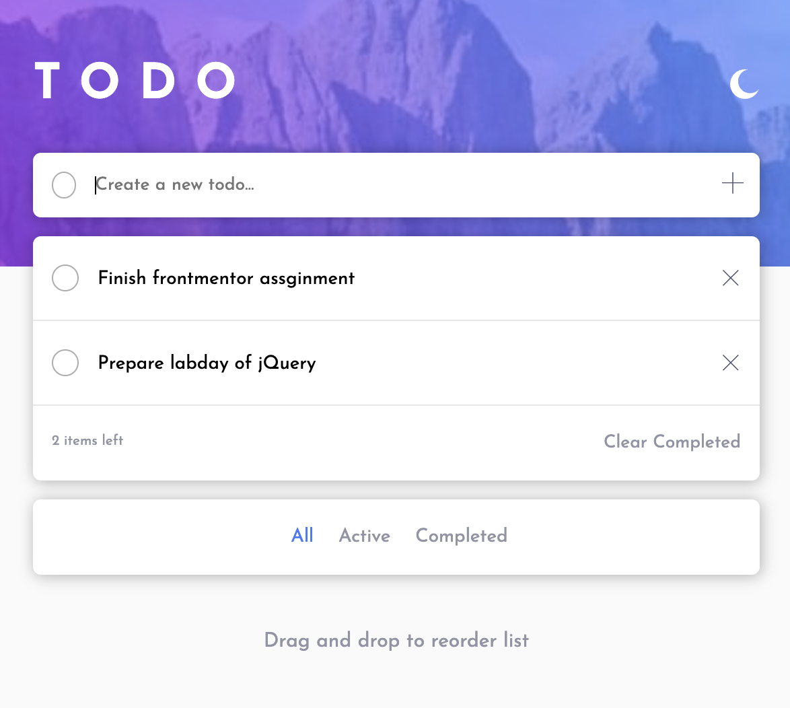

# Frontend Mentor - Todo app solution

## Overview

### The challenge

Users should be able to:

- View the optimal layout for the site depending on their device's screen size
- Add/Delete/Drag Todo
- Filtering Todo
- Check if completed
- Toggle dark/light theme to their preference

### Screenshot

### Links

- Live Site URL: [TODO LIST](https://hello-chloe-seoyeong.github.io/pj_todo/)

## My process

### Built with

- Semantic HTML5 markup
- CSS custom properties
- CSS Flex
- Responsive mobile & desktop
- Javascript
- Using LocalStorage
